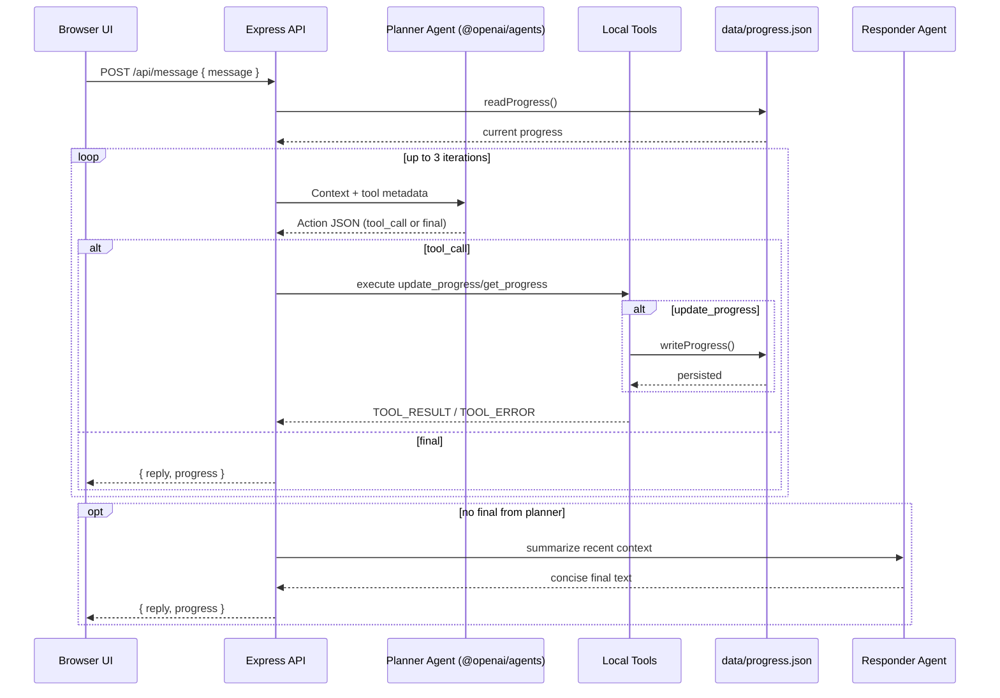
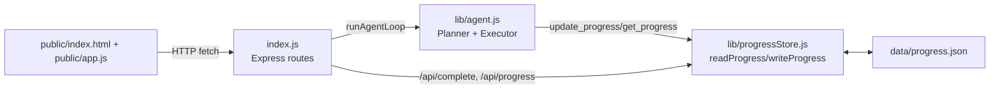

# Agent Study Progress Tracker

A small Node.js + Express app with a minimal browser UI and an agent-style study assistant powered by `@openai/agents`.

## Prerequisites

- Node.js 18+
- OpenAI API key set in your environment:

```bash
export OPENAI_API_KEY=your_key_here
```

For CI, store `OPENAI_API_KEY` in GitHub Secrets.

## Run locally

```bash
npm install
npm start
```

Open `http://localhost:3000`.

## Environment variables

- `OPENAI_API_KEY` (required)
- `PORT` (optional, default: `3000`)
- `OPENAI_MODEL` (optional, default: `gpt-4o-mini`)

## How the agents work

The agent workflow is implemented in `lib/agent.js` and uses a planner/executor loop:

1. The server receives a user message from `POST /api/message`.
2. `runAgentLoop()` builds context with:
   - the user message,
   - current progress from the JSON store,
   - tool metadata (names, args, return shape).
3. A planner agent (`Study Progress Planner`) runs with `@openai/agents` and structured output (`zod` schema).
4. The planner must return one action object:
   - tool call action, e.g. `{ "type": "tool_call", "tool": "update_progress", "args": { "topic": "linear equations" } }`
   - final action, e.g. `{ "type": "final", "text": "..." }`
5. If the planner returns a tool call, the server executes the local tool and appends `TOOL_RESULT` or `TOOL_ERROR` back into context.
6. The loop allows up to 3 planning iterations.
7. If no final answer appears, a second agent (`Study Progress Responder`) synthesizes a short final reply.
8. The API returns `{ reply, progress }` to the UI.

### Agent flow diagram



### Architecture diagram



### File responsibilities

| File                   | Responsibility                                                                                    |
| ---------------------- | ------------------------------------------------------------------------------------------------- |
| `index.js`             | Express app setup, static hosting, and API route handlers.                                        |
| `lib/agent.js`         | Planner/executor loop, tool orchestration, and final response synthesis via `@openai/agents`.     |
| `lib/progressStore.js` | JSON-backed persistence helpers (`readProgress`, `writeProgress`) and progress summary utilities. |
| `public/index.html`    | Single-page UI layout (chat area, progress panel, quick-complete input).                          |
| `public/app.js`        | Frontend event handling and `fetch` calls to backend APIs.                                        |
| `data/progress.json`   | Persistent study state (`goal`, `totalTopics`, `completed`).                                      |
| `README.md`            | Setup, architecture, API, and agent workflow documentation.                                       |

### Available tools

- `update_progress({ topic })`
  - Marks a topic complete (deduplicated by case-insensitive match).
  - Persists updates to `data/progress.json`.
  - Returns `{ goal, totalTopics, completed, percent }`.
- `get_progress()`
  - Reads current persisted progress.
  - Returns `{ goal, totalTopics, completed, percent }`.

## Persistence model

- `lib/progressStore.js` handles file-backed memory.
- `readProgress()` reads and normalizes `data/progress.json`.
- `writeProgress()` writes normalized JSON back to disk.
- Data survives server restarts.

## API endpoints

- `GET /` — serves the web UI.
- `POST /api/message` — body: `{ "message": "..." }`, returns `{ reply, progress }`.
- `POST /api/complete` — body: `{ "topic": "..." }`, marks complete and returns updated progress.
- `GET /api/progress` — returns current progress summary.

## Error handling and validation

- Server validates required fields for `message` and `topic`.
- Tool and agent errors are caught and returned with helpful messages.
- Missing `OPENAI_API_KEY` fails fast with a clear error.
